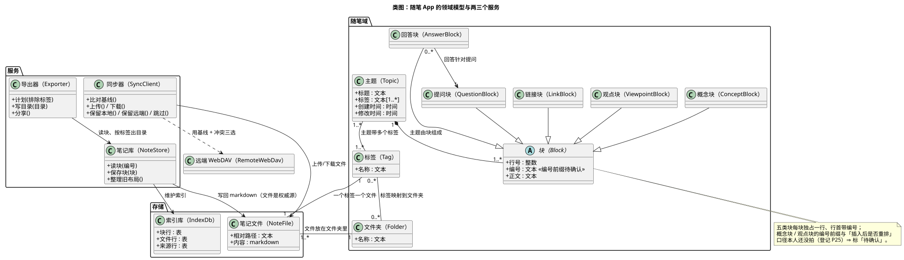

# 02 · 类图（Class Diagram）

## ① 一句话

**类图讲"系统里有哪些种类的东西、它们之间是什么关系"**——是最常用的一张图。
要说明"一条随笔由哪些块组成、块有哪几类、标签怎么决定文件"，就用它。

## ② 关键元素（方框和箭头各代表什么）

| 元素 | 长什么样 | 意思 |
|---|---|---|
| 类（Class） | 三层方框：类名 / 属性 / 操作 | 一类东西。本手册写作 `中文名（English）`，如「主题（Topic）」 |
| 抽象类（Abstract） | 类名斜体 | 只用来被继承、自己不直接实例化（如「块（Block）」） |
| 属性（Attribute） | `+ 名称 : 类型` | 这类东西有哪些数据；`+` 表示公开 |
| 操作（Operation） | `+ 动作(参数)` | 这类东西能做什么 |
| 组合（Composition） | **实心菱形** + 实线 | 整体与部分"同生共死"：主题没了，它的块也就没了（主题 1 — 1..* 块） |
| 聚合（Aggregation） | **空心菱形** + 实线 | 整体包含部分，但部分能独立存在（标签与文件夹） |
| 关联（Association） | 普通实线 | 两类东西之间有联系（回答块针对提问块） |
| 继承 / 泛化（Generalization） | **空心三角** 实线箭头 | "是一种"：链接块、提问块…**都是**块 |
| 依赖（Dependency） | 虚线箭头 | "临时用一下"：笔记库用到笔记文件 |
| 多重度（Multiplicity） | 线两端的 `1`、`1..*`、`0..*` | 一端有几个：一个主题有 1 到多个块 |
| 注释（Note） | 折角方框 | 补充说明（本手册用它标「待确认」的口径） |

## ③ 用共用小例子画的最小示例

**讲的是**：随笔 App 的领域模型——一个**主题**由若干**块**组成，块分五类，**标签**决定它进哪个**笔记文件**，
文件放在**文件夹**里；右边三个服务（笔记库 / 导出器 / 同步器）怎么用这些数据。

看图要点：

- 左边 `随笔域`：主题（带标题、多个标签）**组合**出 1..* 个块；五类块都**继承**自「块」；回答块**关联**提问块（回答是针对某个提问的）。
- 中间：一个**标签**对应**一个笔记文件**（"一个标签一个文件"），标签**映射**成文件夹，文件放在文件夹里。
- 右边三个服务：**笔记库**写回 markdown 并维护索引（文件是权威源、索引是副本）；**导出器**读笔记库、按标签出目录；**同步器**上传下载文件，和远端 WebDAV 之间还要比基线、做冲突三选。
- 图下方注释里那句「编号前缀待确认」是**如实标注**：五类块的编号前缀（如 `C1`、`V1`）与"插入后是否重排"本人还没拍口径（登记 P25），所以图上不写死。

## ④ 源与校验

- 源：`src/class-diagram.puml`（本机 PlantUML 1.2024.8，源码里 `!pragma layout smetana` 用内置布局，因为本机没有 graphviz）
- 图：`figures/class-diagram.svg`
- 校验读数：`evidence/校验-轮1.txt`（`-checkonly` **rc=0、无 error**；`-tsvg` 导出 rc=0）

> 待确认（不是已完成）：五类块的编号前缀与插入/删除后的重排规则（本人 P25 口径未定）；
> 「标签与文件夹」到底是聚合还是关联——本图按"标签映射到文件夹、文件夹可被多个标签共用"画成关联，**待人确认**。
