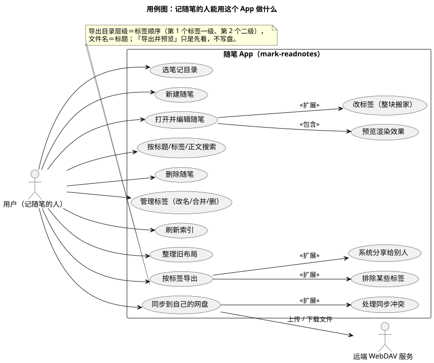

# 03 · 用例图（Use Case Diagram）

## ① 一句话

**用例图讲"谁用它、他能拿它做哪些事"**——不谈内部怎么实现，只列"用户能干什么"。
要跟人确认需求范围（哪些事这一版有、哪些还没有），就用它。

## ② 关键元素（方框和箭头各代表什么）

| 元素 | 长什么样 | 意思 |
|---|---|---|
| 参与者（Actor） | 小人（或方框） | 用这套东西的人或外部系统。本图有两个：**用户**、**远端 WebDAV 服务** |
| 用例（Use Case） | 椭圆 | 一件"对参与者有价值的事"，名字用**动宾**写法（"新建随笔"） |
| 系统边界（Boundary） | 大矩形 / 方框 | 圈出"哪些事是这套系统自己做的"，框外是不属于它的 |
| 关联（Association） | 无箭头实线 | 参与者与用例之间有交互（用户能发起"新建随笔"） |
| 包含（Include） | 虚线箭头 + `<<包含>>` | 这件事**一定会**顺手做另一件（"打开并编辑随笔"里一定会渲染预览） |
| 扩展（Extend） | 虚线箭头 + `<<扩展>>` | 这件事**在特定条件下**才会多做一步（导出时才可能"排除某些标签"） |
| 泛化（Generalization） | 空心三角箭头 | "是一种"（如"导出到目录"是"导出"的一种，本图未用到） |

## ③ 用共用小例子画的最小示例

**讲的是**：记随笔的人在随笔 App 里能做的 15 件事，以及"哪些是必然会顺手做的、哪些是条件性的"。

看图要点：

- 左边**用户**连的是他主动发起的事：选目录、新建、编辑、搜索、删除、管标签、刷新索引、整理旧布局、按标签导出、同步到网盘。
- 方框里是**系统边界**（这 15 件事都是 App 自己做的）；方框外只有两个参与者：用户、远端网盘。
- **包含**：编辑随笔一定会渲染预览（看完效果才知道对不对）。
- **扩展**：编辑时改标签才触发"整块搬家"；导出时才可选"排除标签"、才可能"系统分享"；同步后才可能出现"处理冲突"。
- 与远端 WebDAV 只有一条连线：上传 / 下载文件——网盘不是"人"，是外部系统。

## ④ 源与校验

- 源：`src/use-case-diagram.puml`（`!pragma layout smetana` 内置布局）
- 图：`figures/use-case-diagram.svg`
- 校验读数：`evidence/校验-轮1.txt`（`-checkonly` **rc=0、无 error**；`-tsvg` 导出 rc=0）

> 待确认（不是已完成）：**导入**（把外部 markdown 拉进来、冲突规则还没定，登记 P9）与**块内搜索/标签筛选**（登记 R5）尚未开工，
> 本图**没有**把它们画成"已有"的用例；等本人拍口径后再补进图里。
