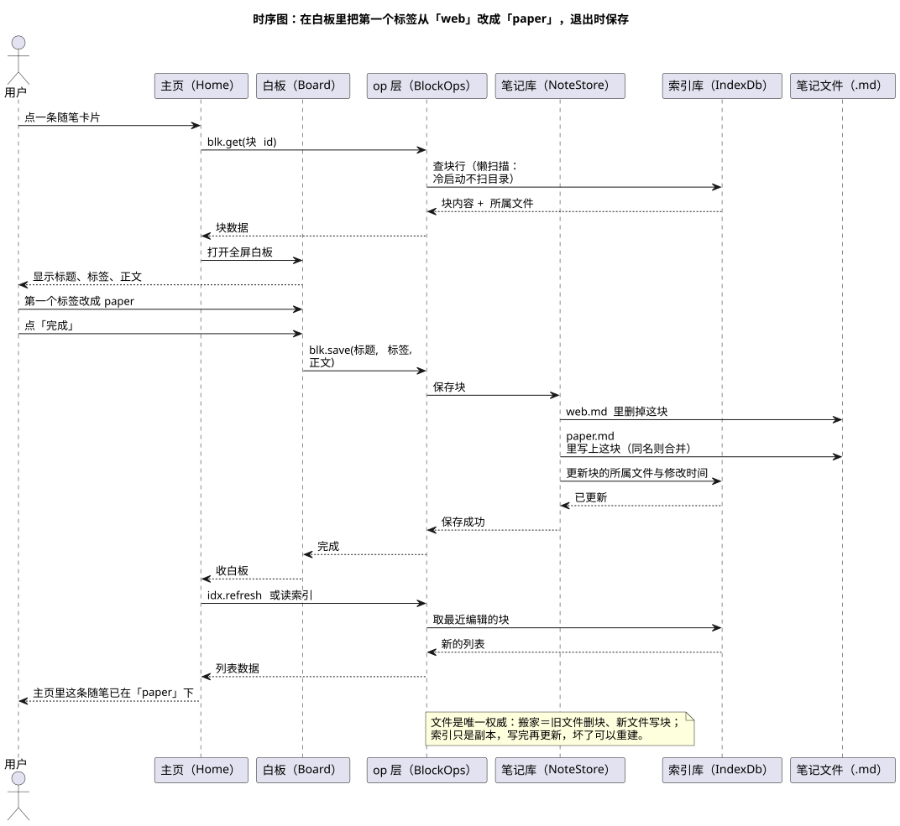

# 04 · 时序图（Sequence Diagram）

## ① 一句话

**时序图讲"一次操作里，几个角色按时间先后互相说了什么"**——重点在**顺序**。
要讲清"点一下保存，后台到底按什么次序动了哪些东西"，就用它。

## ② 关键元素（方框和箭头各代表什么）

| 元素 | 长什么样 | 意思 |
|---|---|---|
| 参与者/对象（Lifeline） | 顶部一个方框 + 下面一条竖虚线 | 这次交互里掺和的每一方（用户、界面、服务、存储） |
| 生命线（Lifeline） | 竖虚线 | 这条线代表"时间往下走" |
| 激活条（Activation） | 线上一个细长矩形 | 这一方正在干活的那段时间 |
| 同步消息（Synchronous Message） | **实线实心箭头** | 叫对方做一件事，**等它做完**才继续（如"保存块"） |
| 返回消息（Reply Message） | **虚线箭头** | 把结果送回来（"保存成功"） |
| 自消息（Self Message） | 拐回自己的箭头 | 自己在内部处理一下 |
| 创建 / 销毁 | 指向方框的箭头 / 末尾的 × | 现场新建或结束一个对象 |
| 组合片段（Combined Fragment） | 方框左上角标签（`alt` 二选一、`loop` 循环、`opt` 可选） | 分支与循环；本图是最短路径，没有用到 |
| 注释（Note） | 折角方框 | 补充说明 |

## ③ 用共用小例子画的最小示例

**讲的是**：在白板里把第一个标签从 `web` 改成 `paper`，点「完成」退出时，**搬家**这件事是怎么一步步发生的。

看图要点（自上而下就是时间顺序）：

1. 用户点主页上的一条卡片 → 主页调 `blk.get(块 id)` 拿数据（**冷启动不扫目录**，只从索引里读）。
2. 主页把数据交给白板，白板显示标题、标签、正文。
3. 用户把第一个标签改成 `paper`，点「完成」→ 白板调 `blk.save(...)`。
4. **关键的一步在"笔记文件"这一列**：`web.md` 里删掉这块、`paper.md` 里写上这块（同名就合并）——这就是"改标签＝整块搬家"。
5. 写完文件再更新索引（块的所属文件、修改时间），最后主页重读索引，用户看到这条随笔已经挂在 `paper` 下。
6. 图下方的注释点明先后关系：**先写文件、再更新索引**；文件是权威源，索引只是副本，坏了可以重建。

## ④ 源与校验

- 源：`src/sequence-diagram.puml`（时序图不需要额外布局程序，本机可直接导）
- 图：`figures/sequence-diagram.svg`
- 校验读数：`evidence/校验-轮1.txt`（`-checkonly` **rc=0、无 error**；`-tsvg` 导出 rc=0）

> 待确认（不是已完成）：图里 `idx.refresh` 之前画的是"或读索引"——冷启动到底走哪条、
> 保存后主页是"就地更新一行"还是"整表重读"，本人若要更精确的时序，下一轮按代码逐行核一遍再补（本轮按现有源码的行为画，未逐行核对）。
