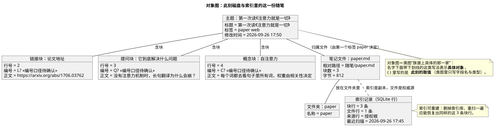

# 05 · 对象图（Object Diagram）

## ① 一句话

**对象图讲"某一时刻，具体是哪几个东西、各自什么取值"**——它是类图的"快照"。
要说明"这条随笔此刻在磁盘和索引里到底长什么样"（而不是"随笔由什么组成"），就用它。

## ② 关键元素（方框和箭头各代表什么）

| 元素 | 长什么样 | 意思 |
|---|---|---|
| 对象（Object） | 方框，名字**带下划线** | 具体的一个实例，写法 `对象名 : 类名` 或 `类名 : 对象名` |
| 槽 / 取值（Slot / Value） | 对象方框里 `字段 = 具体值` | 这一刻该字段的**实际值**（类图里只写 `字段 : 类型`） |
| 链接（Link） | 对象之间的实线 | 两个对象之间**实际的**联系（类图里那条叫关联） |
| 链接上的角色名 | 线上的文字（`含块`） | 这条联系在这边叫什么 |
| 多重性/数量的体现 | 直接由**对象个数**体现 | 类图写 `1..*`，对象图就真的画出 3 个块 |
| 注释（Note） | 折角方框 | 补充说明 |

**和类图的关系**：类图是"族谱"（有哪些种类、怎么算合法），对象图是"族谱上具体的一家"（这一刻谁在、值是多少）。
对象图通常只画**关键的一个片段**，不画全系统。

## ③ 用共用小例子画的最小示例

**讲的是**：共用小例子（**随笔 App / mark-readnotes**，名词表见 `01-选哪种图.md` §2）里的一条随笔「第一次读《注意力就是一切》」（标签 `paper web`）此刻的样子——3 个块、一个文件、一个文件夹、一行索引。

看图要点：

- 一条**主题**对象下挂 3 个块对象：**链接块**（论文地址）、**提问块**（要解决什么问题）、**概念块**（自注意力）。
- 块的**编号**这里写成 `L? / Q? / C?`，旁边注「编号口径待确认」——因为本人还没拍五类块的编号前缀（登记 P25），**不写死**。
- 箭头 → **笔记文件 `paper.md`**，并注明"归属文件由第一个标签 `paper` 决定"（这就是"改第一个标签＝整块搬家"的对象级表现）。
- 文件 → **文件夹 `paper`**；文件 ⇢ **索引记录**用虚线，并注"索引是副本，文件是权威源"。
- 右下注释点了类图/对象图的分工，以及"索引可重建"这条：删掉索引重扫应能恢复同样的 3 条块行。

## ④ 源与校验

- 源：`src/object-diagram.puml`（本机 PlantUML 1.2024.8；`!pragma layout smetana` 用内置布局，因为本机没有 graphviz）
- 图：`figures/object-diagram.svg`
- 校验读数：`evidence/校验-轮2.txt`（`-checkonly` **rc=0、无 error**；`-tsvg` rc=0）

> 待确认：五类块的编号前缀与"插入/删除后是否重排"（P25，本人未拍）；示例里 `paper.md` 的字节数与行号是**示意值**，不是实测读数（本轮目的是练图，不是核数据）。
