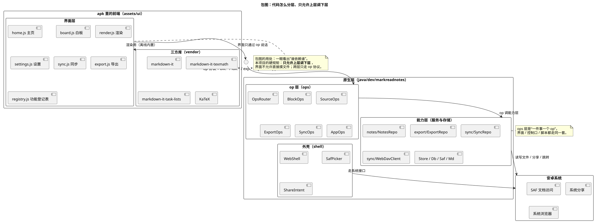

# 06 · 包图（Package Diagram）

## ① 一句话

**包图讲"代码/模块怎么分组、谁依赖谁"**——把一堆类收进"大箱子"，看箱子之间的依赖方向。
要说明"界面能不能直接摸文件""换个实现要动哪一层"，就用它。

## ② 关键元素（方框和箭头各代表什么）

| 元素 | 长什么样 | 意思 |
|---|---|---|
| 包（Package） | 带标签页的方框 | 一组**同类东西**的容器（本手册里＝一层代码或一个目录） |
| 包内容 | 包框里再摆类/组件 | `[home.js 主页]` 这种写法表示包里的元素 |
| 依赖（Dependency） | **虚线箭头** `-->` | 箭头指哪儿＝**它要用那边的**；线上可写 `<<use>>`/`<<import>>` |
| 包的嵌套 | 大包套小包 | 分组的分组（本手册：前端 ▸ 界面层 ▸ 各文件） |
| 接口（Interface） | 单个方框（也可画成小球） | 层与层之间约定的"说话方式"（本例＝`op 协议`） |
| 注释（Note） | 折角方框 | 补充说明（本手册用它写"分层硬规矩"） |

**看图三问**：谁在最上面（最常改）？箭头是不是**一层一层往下**（有没有跳层）？两个包互相依赖吗（那就是耦合，要拆）。

## ③ 用共用小例子画的最小示例

**讲的是**：随笔 App 的五层摆放——**界面层（前端 7 个文件）→ op 协议 → op 层 → 能力层 → 安卓系统**，加一个离线内置的三方库包。

看图要点：

- 上面的包是**前端**（`home.js / board.js / render.js / settings.js / sync.js / export.js / registry.js`），
  它只通过一条**虚线**指向 `op 协议`：**界面不允许直接摸文件**（这是我们的分层硬规矩）。
- 中间是**原生层**：`ops`（op 层：`OpsRouter` + 各业务 op）依赖 `能力层`（`notes/export/sync/Store/Db/Saf`）；
  `外壳（shell）`负责选目录、分享这类系统动作。
- 最下面是**安卓系统**（SAF 文档访问、系统分享、浏览器）——只有能力层与外壳碰它。
- 右侧单独摆一个 `vendor` 包（markdown-it / texmath / task-lists / KaTeX）：**离线内置**，只在渲染时用，用**虚线**表示"用"而不是"依赖它的接口"。
- 注释写了包图的实际用处：一眼看出"谁依赖谁"；跨层只走 op 协议 ⇒ 以后加功能主要是往 op 层和能力层加，不动界面骨架。

## ④ 源与校验

- 源：`src/package-diagram.puml`（`!pragma layout smetana`）
- 图：`figures/package-diagram.svg`
- 校验读数：`evidence/校验-轮2.txt`（`-checkonly` **rc=0、无 error**；`-tsvg` rc=0）

> 待确认：包图里的元素名取的是**文件名/模块名**（`home.js` 这类），不是类名——因为我们的前端是脚本文件，**不是每个文件都有"类"**；
> 若本人希望包图只画类，需要另做一张（本轮按代码实际形态画）。
