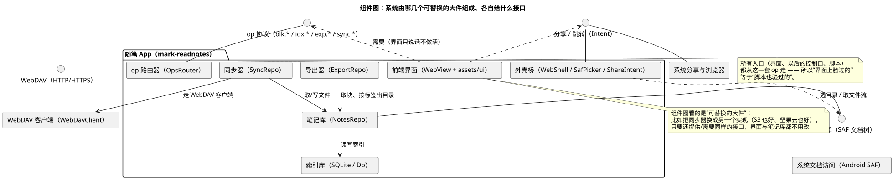

# 07 · 组件图（Component Diagram）

## ① 一句话

**组件图讲"系统由哪几个可替换的大件组成、每个大件对外给什么接口、又需要别人给什么"**。
要说明"同步器能不能换一个实现而界面不用改"，就用它。

## ② 关键元素（方框和箭头各代表什么）

| 元素 | 长什么样 | 意思 |
|---|---|---|
| 组件（Component） | 方框，左上角带小方块标记（或写 `«component»`） | 一个**可替换的大件**（不是一个小类，而是一块能整体换掉的能力） |
| 提供的接口（Provided Interface） | 组件连着的一条线 + **小球**（或用方框标出接口名） | "我对外提供这个能力"（本手册：`op 协议`、`文件读写`） |
| 需要的接口（Required Interface） | 组件连着的一条线 + **插座（半圆）** | "我要用别人提供的能力"（本手册：界面需要 `op 协议`、同步器需要 `WebDAV`） |
| 依赖（Dependency） | 虚线箭头 | 用到对方的接口（`..>`） |
| 组合/装配（Assembly） | 球插进插座 | 一个的"提供"对上另一个的"需要"（接口对接口） |
| 端口（Port） | 组件边框上的小方块 | 明确的交互点（本手册未用，写在这里备查） |
| 包 / 节点 | 外层方框 | 这些组件属于谁（本例：都属于这个 App，除了 WebDAV 客户端与系统件） |

**和类图的区别**：类图讲"数据长什么样"，组件图讲"哪几块活、彼此的接口"。**和包图的区别**：包图看"代码放在哪个箱子"，组件图看"能换掉哪一块"。

## ③ 用共用小例子画的最小示例

**讲的是**：随笔 App 的 7 个组件 + 4 个接口——前端、op 路由器、笔记库、导出器、同步器、索引库、外壳桥；接口是 `op 协议`、`文件读写（SAF）`、`WebDAV`、`分享/跳转`。

看图要点：

- **前端**只有一个"需要"：`op 协议`（虚线插座）——它不做活，只说话；它还要一个 `分享/跳转` 接口。
- **op 路由器**提供 `op 协议`（小球），把请求分给 `笔记库 / 导出器 / 同步器`。
- **笔记库**需要 `文件读写（SAF）`，并且依赖 `索引库`（SQLite）：文件是权威源、索引是副本。
- **导出器**从笔记库取块、按标签出目录；**同步器**从笔记库取/写文件，再走 **WebDAV 客户端**（它自己提供 `WebDAV` 接口）。
- **外壳桥**提供"分享/跳转"这类系统动作，并需要 `文件读写`（选目录、取文件流）；`系统文档访问（SAF）` 与 `系统分享/浏览器` 在最下面提供各自的接口。
- 注释点明组件图的价值：**换实现不动别人**——把同步器换成别的实现，只要仍提供/需要同样的接口，界面与笔记库都不用改。

## ④ 源与校验

- 源：`src/component-diagram.puml`（`!pragma layout smetana`，本机无 graphviz）
- 图：`figures/component-diagram.svg`
- 校验读数：`evidence/校验-轮2.txt`（`-checkonly` **rc=0、无 error**；`-tsvg` rc=0）

> 待确认：**"端口（Port)"这一层我们代码里没有显式实现**（op 是通过 JS 桥的字符串协议走的），所以本图用"提供/需要接口"表达，**没有**画端口方框；
> 若本人想看"端口"的画法，我下一轮在组件图里补一张带 port 的变体（不影响语法校验）。
