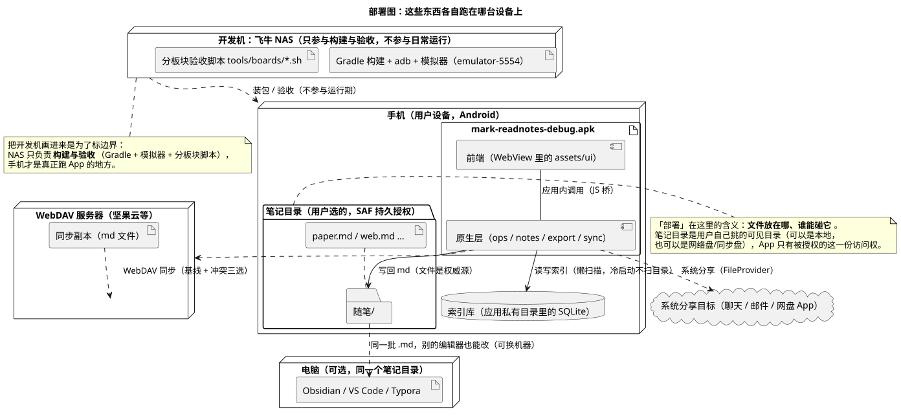

# 08 · 部署图（Deployment Diagram）

## ① 一句话

**部署图讲"这些东西各自跑在哪台设备上、彼此怎么连"**——把软件摆到真实机器上。
要说明"文件到底存在手机还是网盘""构建机在哪"，就用它。

## ② 关键元素（方框和箭头各代表什么）

| 元素 | 长什么样 | 意思 |
|---|---|---|
| 节点（Node） | 立体方框（`«device»` / `«node»`） | 一台设备或一个运行环境（手机、WebDAV 服务器、电脑、开发机） |
| 制品（Artifact） | 方框 + `«artifact»` 记号 | 实际存在的东西：`apk` 文件、`md` 文件、脚本 |
| 部署关系 | 制品画在节点**里面**（或虚线箭头 `--`） | 这个东西跑/放在那台机器上 |
| 通信路径（Communication Path） | 两个节点之间的实线 | 两台机器之间有连接（网络、USB） |
| 组件（Component） | 节点内的方框 | 该节点上跑哪块软件（前端、原生层） |
| 文件夹/库 | 节点内的文件夹、库图标 | 数据放在哪（笔记目录、索引库） |
| 云（Cloud） | 云朵形状 | 外部服务（第三方网盘、分享目标） |
| 注释 | 折角方框 | 补充说明（本手册用它标"谁能碰文件"） |

**看图三问**：谁跑在哪？数据在谁手上？跨机器的连线是什么（网络/USB/同步）？

## ③ 用共用小例子画的最小示例

**讲的是**：随笔 App 的四类机器——**手机**（跑 App、拿笔记目录与索引）、**WebDAV 服务器**（同步副本）、
**电脑**（同一个笔记目录，用别的编辑器看）、**开发机（飞牛 NAS，只做构建与验收）**，加一个"系统分享目标"云。

看图要点：

- **手机节点**里：`mark-readnotes-debug.apk`（制品）内含前端（WebView 里的 `assets/ui`）与原生层（`ops/notes/export/sync`）；
  另有**索引库**（应用私有目录里的 SQLite）与**笔记目录**（用户选的可见目录，SAF 持久授权），笔记目录里是 `随笔/` 与一批 `.md`。
- **数据边界的注释**放在笔记目录旁：部署图的"部署"在这里就是**文件放在哪、谁能碰它**——App 只有被授权的这一份访问权；
  目录可以是本地，也可以是网络盘/同步盘。
- 手机 → **系统分享目标**（聊天/邮件/网盘）走 FileProvider；手机 → **WebDAV 服务器**走同步（基线 + 冲突三选），服务器上是一份 md 副本。
- **电脑**与手机共用同一批 `.md`（可换机器、可换编辑器——这也是"文件是权威源"的实测意义）。
- **开发机（飞牛 NAS）**单独画出来并注边界：它跑 Gradle 构建、adb 装包、模拟器 `emulator-5554` 与分板块验收脚本，
  **只参与构建与验收，不参与日常运行**。

## ④ 源与校验

- 源：`src/deployment-diagram.puml`（`!pragma layout smetana`）
- 图：`figures/deployment-diagram.svg`
- 校验读数：`evidence/校验-轮2.txt`（`-checkonly` **rc=0、无 error**；`-tsvg` rc=0）

> 待确认：图里的设备名（"坚果云等"）是**举例**不是实测选定的服务；实际同步目标由本人填。
> 另：真机（非模拟器）尚未验证过（缺口清单 C 段已记"未测真机"），本图按现有实际形态画，**未验 ≠ 通过**。
