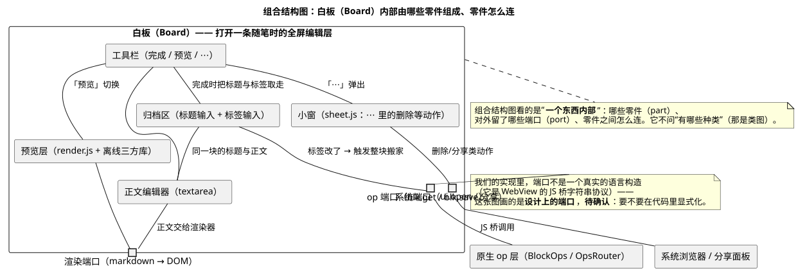

# 09 · 组合结构图（Composite Structure Diagram）

## ① 一句话

**组合结构图讲"一个东西（或一个系统）内部由哪些零件组成、零件之间怎么连、对外留了哪些口"**。
要说明"白板这一层内部是怎么拼起来的""换掉其中一个零件会不会影响别人"，就用它。

## ② 关键元素（方框和箭头各代表什么）

| 元素 | 长什么样 | 意思 |
|---|---|---|
| 组合体 / 类元（Classifier） | 最外层的方框（写清是"谁的内部"） | 被剖开来看的那个整体（本例：**白板 Board**） |
| 零件（Part） | 组合体里面的方框 | 它内部的**部件**（归档区、正文编辑器、工具栏、预览层、小窗） |
| 端口（Port） | 边界上的小方块 | 对外（或对内）**约定好的交互点**（本例：op 端口、渲染端口、系统端口） |
| 连接件（Connector） | 零件之间的实线（可带文字） | 零件之间**实际怎么连**、传什么（"标签改了 → 触发整块搬家"） |
| 接口（球/插座） | 线端的小球/半圆 | 这个口提供的 / 需要的接口（与组件图同一种画法） |
| 外部参与者 | 组合体外的方框 | 与它对接的别的东西（原生 op 层、系统浏览器） |
| 注释 | 折角方框 | 补充说明（本手册用它标「待确认」） |

**和类图/组件图的区别**：类图讲"有哪些种类"，组件图讲"系统能换成哪几个大件"，**组合结构图讲"一个东西自己内部的接线图"**。

## ③ 用共用小例子画的最小示例

**讲的是**：共用小例子（**随笔 App / mark-readnotes**，名词表见 `01-选哪种图.md` §2）里，**打开一条随笔时的白板**内部——
五个零件（归档区、正文编辑器、工具栏、预览层、小窗）、三个端口（op / 渲染 / 系统），以及它们与原生 op 层、系统浏览器怎么对接。

看图要点：

- **归档区**（标题 + 标签）与**正文编辑器**是同一个块的两半：归档区改了标签就会触发"整块搬家"（连到 op 端口）。
- **工具栏**连着归档区（取走标题与标签）、正文区、预览层（切换）、小窗（「⋯」里的删除等）。
- **预览层**通过"渲染端口"接正文——渲染只认数据，不认业务（这也是我们渲染器层的规矩）。
- 三个**端口**把白板与外界分开：`op 端口`（`blk.get`/`blk.save`）、`渲染端口`、`系统端口`（跳浏览器/分享）。
- 注意左下注释：**端口在我们的实现里不是语言构造**（它是 WebView 的 JS 桥字符串协议）——这张图画的是**设计上的端口**；
  要不要在代码里显式化，标**待确认**。

## ④ 源与校验

- 源：`src/composite-structure-diagram.puml`（`!pragma layout smetana`，本机无 graphviz）
- 图：`figures/composite-structure-diagram.svg`
- 校验读数：`evidence/校验-轮3.txt`（`-checkonly` **rc=0、无 error**；`-tsvg` rc=0；**错误占位检查=0**）

> 待确认：端口是否在代码里显式化（现在只是约定）；"小窗（sheet.js）"算不算白板的一个零件（它其实盖在白板上方，属同一交互回合，本图按零件画）。
