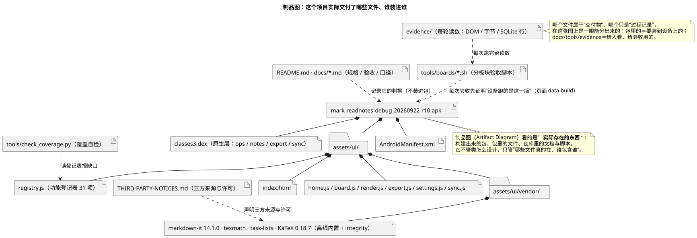

# 10 · 制品图（Artifact Diagram）

## ① 一句话

**制品图讲"实际存在哪些文件/构建产物、谁包含谁、谁依赖谁"**——它是"打包清单 + 依赖关系"。
要说明"交付给用户的是哪个文件""文档和脚本算不算交付物"，就用它。

## ② 关键元素（方框和箭头各代表什么）

| 元素 | 长什么样 | 意思 |
|---|---|---|
| 制品（Artifact） | 方框 + `«artifact»` 记号 | 一个**实在的东西**：安装包、文档、脚本（本例：`.apk`、`README.md`、验收脚本） |
| 文件（File） | 方框 + `«file»`/「文件」记号 | 制品内部的单个文件（`classes3.dex`、`index.html`） |
| 文件夹（Folder） | 带标签页的方框 | 一组文件的目录（`assets/ui/`、`vendor/`） |
| 包含（Composition） | **实心菱形** + 实线 | "装在谁里面"（apk 里装着 dex 与 assets） |
| 依赖（Dependency） | **虚线箭头** | "用到/记录它"，但**不装进去**（文档记录判据、脚本读登记表） |
| 部署（Manifestation） | 虚线 + `«manifest»` | 制品与它实现的组件（本图用包含关系代替，够用） |
| 注释 | 折角方框 | 补充说明 |

**和组件图的区别**：组件图讲"能换掉哪一块逻辑"，制品图讲"**磁盘上真的有哪个文件**"。

## ③ 用共用小例子画的最小示例

**讲的是**：共用小例子（**随笔 App / mark-readnotes**，名词表见 `01-选哪种图.md` §2）的交付物清单——
**要装进设备的**（`apk` ▸ `classes3.dex` + `assets/ui/` ▸ 各 `.js` ▸ `vendor/` 里的离线库）与
**给别人看/给验收用的**（`README.md` + `docs/`、`tools/boards/*.sh`、`tools/check_coverage.py`、`evidence/`、`THIRD-PARTY-NOTICES.md`）。

看图要点：

- 上半部分＝**装到设备上的**：`mark-readnotes-debug-20260922-r10.apk` 里装着 `AndroidManifest.xml`、`classes3.dex`（原生层）、
  `assets/ui/`（前端）——`assets/ui/` 里再装 `index.html`、`registry.js`（**31 项功能登记表**）、各页面脚本、与 `vendor/`（离线内置的 markdown-it / KaTeX 等）。
- 下半部分＝**不装进包的**，全部用**虚线**连向它们服务的东西：文档记录判据、验收脚本每次先证明"设备跑的是这一版"、
  覆盖自检读登记表报缺口、`evidence/` 留每轮读数、`THIRD-PARTY-NOTICES.md` 声明三方来源与许可。
- 这张图的实际用处：**别人拿到这个仓库，一眼知道"要装的是哪个文件、哪些只是过程材料"**。

## ④ 源与校验

- 源：`src/artifact-diagram.puml`（`!pragma layout smetana`）
- 图：`figures/artifact-diagram.svg`
- 校验读数：`evidence/校验-轮3.txt`（`-checkonly` **rc=0、无 error**；`-tsvg` rc=0；**错误占位检查=0**）

> 待确认：图里的 `r10` 是**举例**（`apk/` 里 r9/r10 都在，README 的"当前构件"那行仍写 r8——这个不一致已由经理登记，未改文档）；
> 若本人要"制品图必须对得上某个具体构件"，请指定版本，我再核一次哈希。
