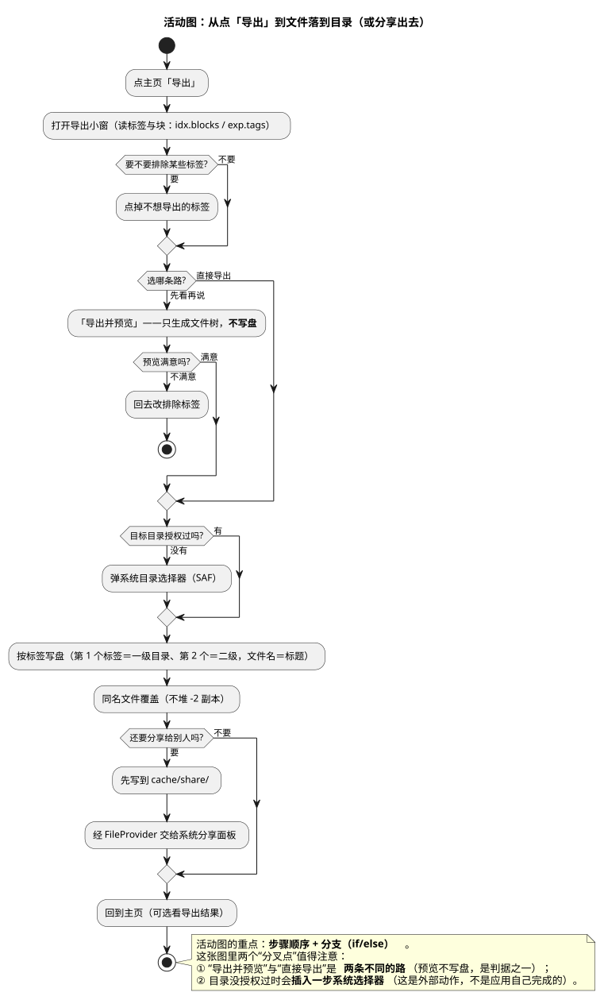

# 11 · 活动图（Activity Diagram）

## ① 一句话

**活动图讲"一件事从头到尾有哪些步骤、哪里会分叉"**——它就是流程图。
要说明"点一下导出到底发生了什么""哪一步会插进系统动作"，就用它。

## ② 关键元素（方框和箭头各代表什么）

| 元素 | 长什么样 | 意思 |
|---|---|---|
| 起始 / 结束（Initial / Final） | **实心圆** →／**牛眼** | 流程的开头与结尾 |
| 动作（Action） | 圆角方框 | 一个**有名字的步骤**（"点主页「导出」"） |
| 控制流（Control Flow） | 带箭头的实线 | 步骤之间的先后 |
| 判断 / 分支（Decision / Merge） | **菱形** + `if…then…else` | 二选一（"要不要排除某些标签？"） |
| 分岔 / 汇合（Fork / Join，本图未用） | 粗黑条 | 并行（两件事同时做） |
| 对象 / 数据（本图用注释代替） | 方框（`«object»`） | 步骤之间传的东西 |
| 泳道（Swimlane，本图未用） | 竖向分区 | 哪一步由谁负责（人多时才有用） |
| 注释 | 折角方框 | 补充说明 |

**和时序图的区别**：活动图看**步骤与分支**（不看谁跟谁说话），时序图看**谁在什么时候对谁说了什么**。

## ③ 用共用小例子画的最小示例

**讲的是**：共用小例子（**随笔 App / mark-readnotes**，名词表见 `01-选哪种图.md` §2）里的**按标签导出**流程——
从点「导出」到文件落到目录，或者分享给别的应用。

看图要点：

- 起点是"点主页导出"→"打开导出小窗（读标签与块）"，然后**第一个分叉**：要不要排除某些标签。
- **第二个分叉（这条流程的关键）**："导出并预览"与"直接导出"是**两条不同的路**——
  预览**只生成文件树、不写盘**（我们的判据之一：预览后目标目录仍不存在）；预览不满意还能回头改排除项（图里那条回头路）。
- **第三个分叉**：目标目录**没授权过**时会**插进一步系统目录选择器**（SAF）——这是一个**外部动作**，不是应用自己能完成的；
  画出来是为了提醒：这一路会跳出应用。
- 之后是按标签写盘（第 1 个标签＝一级目录、第 2 个＝二级、文件名＝标题、同名覆盖），
  最后**第四个分叉**：要不要分享（要则先写 `cache/share/`，再经 FileProvider 交给系统分享面板）。

## ④ 源与校验

- 源：`src/activity-diagram.puml`（活动图本机可直接导，**未加** smetana；实测 rc=0 且图正常）
- 图：`figures/activity-diagram.svg`
- 校验读数：`evidence/校验-轮3.txt`（`-checkonly` **rc=0、无 error**；`-tsvg` rc=0；**错误占位检查=0**）

> 待确认：图里"预览不满意 → 回去改排除标签"画成了一条**结束流程**（stop）而不是回到上一步——
> 实际界面上是留在同一个小窗里继续改（不退出）；若本人认为该画成回环，我下一轮改。
