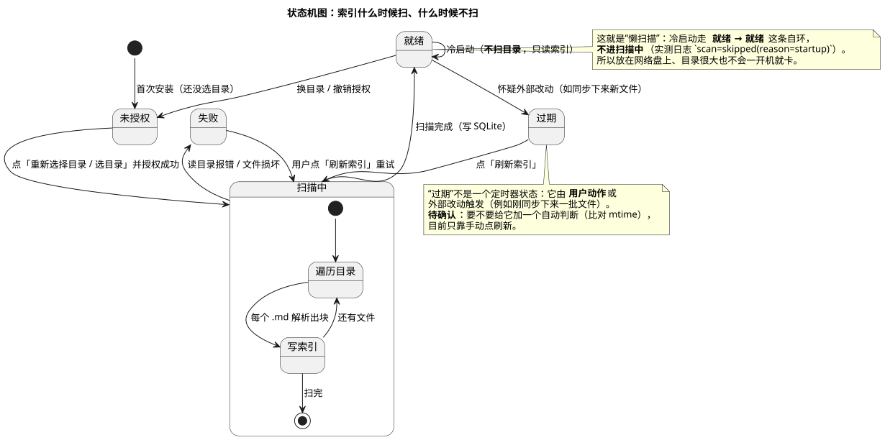

# 12 · 状态机图（State Machine Diagram）

## ① 一句话

**状态机图讲"一个东西有哪些状态、什么事情让它从一个状态跳到另一个"**——像红绿灯。
要说明"索引什么时候会去扫目录、什么时候不会"，就用它。

## ② 关键元素（方框和箭头各代表什么）

| 元素 | 长什么样 | 意思 |
|---|---|---|
| 状态（State） | 圆角方框 | 这东西**当前处在什么状况**（未授权 / 扫描中 / 就绪 / 过期 / 失败） |
| 起始状态 | **实心圆** | 初始状态（本例：刚装好还没选目录） |
| 终止状态 | **牛眼** | 结束（本例的状态机不终止，一直循环） |
| 迁移（Transition） | 带箭头的实线 + `事件 [条件] / 动作` | 发生什么事就从 A 到 B（点刷新 → 扫描中） |
| 自迁移（Self Transition） | 回到自己的箭头 | 状态不变、只是又走了一遍（**冷启动：就绪 → 就绪**） |
| 复合状态（Composite State） | 大状态里套小状态 | 一个状态内部还有子状态（扫描中 ▸ 遍历目录 ⇄ 写索引） |
| 守卫条件 `[条件]` | 方括号 | 满足才跳（本图用文字写在迁移上） |
| 注释 | 折角方框 | 补充说明（本手册用它标「待确认」） |

**看状态机的三问**：有几个状态？每个状态**靠什么事件**离开？有没有**跳不回去的死角**（本例特意画了"失败 → 刷新 → 扫描中"这条回来的路）。

## ③ 用共用小例子画的最小示例

**讲的是**：共用小例子（**随笔 App / mark-readnotes**，名词表见 `01-选哪种图.md` §2）里**索引与扫描的状态**——
这就是"懒扫描"那张图的文字版。

看图要点：

- 五个状态：**未授权**（刚装好）· **扫描中**（复合状态：遍历目录 ⇄ 写索引）· **就绪** · **过期**（怀疑外部改动）· **失败**。
- 最关键的一条是 **就绪 → 就绪 的自迁移**：这就是**冷启动不扫目录**（实测日志 `scan=skipped(reason=startup)`）——
  所以笔记目录放在网络盘、文件再多，开机也不会卡。
- **过期不是定时器**：它由**用户动作**（点了刷新）或外部改动（同步下来新文件）触发 ⇒ 图里给了它一条去"扫描中"的路。
  **待确认**：要不要加自动判断（比对 mtime），目前只靠手动点。
- **失败不是死角**：`失败 → 扫描中` 那条回流保证"点一次刷新就能重试"。
- 换目录/撤销授权会回到"未授权"（这也是判据 F1 的对象）。

## ④ 源与校验

- 源：`src/state-machine-diagram.puml`
- 图：`figures/state-machine-diagram.svg`
- 校验读数：`evidence/校验-轮3.txt`（`-checkonly` **rc=0、无 error**；`-tsvg` rc=0；**错误占位检查=0**）

> **本轮踩到并已修掉的一个坑（值得记住）**：状态机图**默认要 graphviz**，本机没有 ⇒ 第一次导出虽 `rc=0`，
> 但 svg 其实是**一张写着 "Cannot find Graphviz" 的报错占位图**（3.9KB）。
> 处理：给这一块也加 `!pragma layout smetana`，重导后 svg **18KB**、内容正常；
> 并在证据里加了**"错误占位检查"闸门**（逐个 svg grep `Cannot find Graphviz` / `Syntax Error`，必须为 0）——
> 这就是"**rc=0 ≠ 图对**"的实例。
