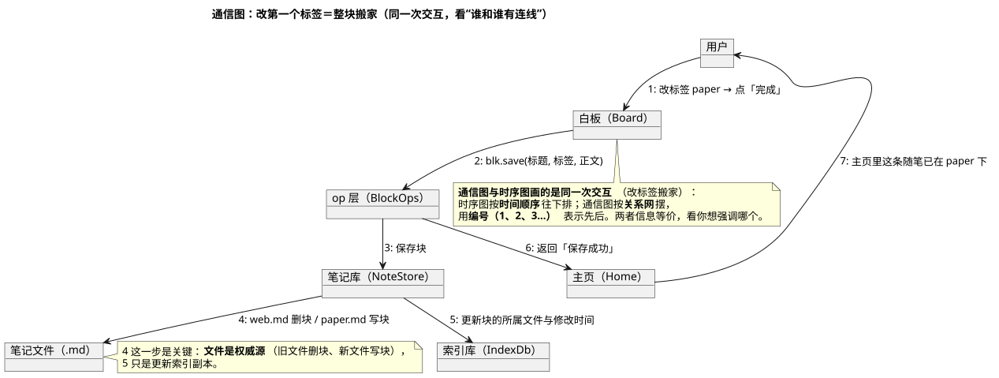

# 13 · 通信图（Communication Diagram）

## ① 一句话

**通信图讲"一次交互里谁和谁有连线"**——和时序图**讲的是同一件事**，只是摆法不同：时序图按时间往下排，通信图按关系网摆、用编号表示先后。
要强调"这次操作里一共有哪几方掺和、谁连着谁"，就用它。

## ② 关键元素（方框和箭头各代表什么）

| 元素 | 长什么样 | 意思 |
|---|---|---|
| 对象/参与者（Lifeline 的另一种画法） | 方框 | 这次交互掺和的每一方（用户、白板、op 层、笔记库、文件、索引库、主页） |
| 链接（Link） | 两方之间的实线 | 这两方**直接说话**（不画时间轴） |
| 消息（Message） | 线上的箭头 + **序号** | 第几步、说了什么（`1: 改标签`）；**序号就是顺序**，这是它替代时间轴的方式 |
| 并发消息 | 同级编号 + 字母（`1a`、`1b`，本图未用） | 同时发生 |
| 自消息（Self Message） | 拐回自己的箭头 | 自己内部处理 |
| 注释 / 图例 | 折角方框 / `legend` | 补充说明 |

**与时序图的取舍**：**通信图**在"方多、连线多"时更省地方（一眼看拓扑）；**时序图**在"顺序复杂、有分支/循环"时更清楚。
UML 里这两张图**可以互相转换**（本手册故意用同一件事各画一张，方便对照）。

## ③ 用共用小例子画的最小示例

**讲的是**：共用小例子（**随笔 App / mark-readnotes**，名词表见 `01-选哪种图.md` §2）里「**改第一个标签＝整块搬家**」这一次交互
——与 `04-时序图.md` 是**同一件事**，这里换成关系网 + 编号的写法。

看图要点：

- 七方：**用户 → 白板 → op 层 → 笔记库 →{笔记文件、索引库}→ 主页 → 用户**，编号 1–7 就是顺序。
- 关键仍是第 **4** 步：**旧文件删块、新文件写块**（文件是权威源）；第 **5** 步只是更新索引副本。
- 对照 `04-时序图.md` 能看出：**同一组消息、同一组对象**，一个按时间轴画、一个按连线画；
  时序图里那条"生命周期竖线"在这里被"编号"替代了。

## ④ 源与校验

- 源：`src/communication-diagram.puml`（`!pragma layout smetana`，本机无 graphviz）
- 图：`figures/communication-diagram.svg`
- 校验读数：`evidence/校验-轮4.txt`（`-checkonly` **rc=0、无 error**；`-tsvg` rc=0；**错误占位检查=0**）

> 待确认：PlantUML **没有**专门的"通信图"类型，本图用「对象 + 带编号的箭头」画（UML 语义等价）；
> 若本人想要更"教科书式"的画法（每个链接上标箭头的方向图案），可以下一轮改用别的渲染方式，**但本手册只保证语义与判据**。
