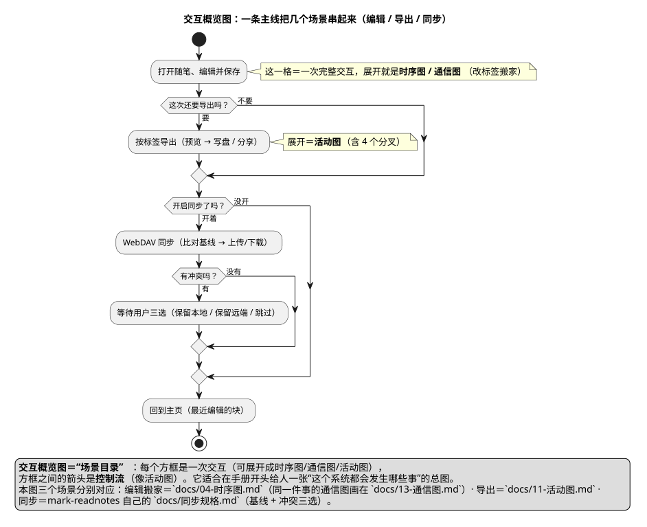

# 14 · 交互概览图（Interaction Overview Diagram）

## ① 一句话

**交互概览图＝"场景目录"**：每个方框是一次**交互**（可以展开成时序图/通信图/活动图），方框之间的箭头是**控制流**。
要给人一张"这个系统都会发生哪些事、它们怎么串起来"的总图，就用它。

## ② 关键元素（方框和箭头各代表什么）

| 元素 | 长什么样 | 意思 |
|---|---|---|
| 交互引用（Interaction Use，`ref`） | 圆角方框（本手册写成"这一格＝一次交互"） | 一**整次交互**的引用（展开就是一张时序图/通信图/活动图） |
| 控制流（Control Flow） | 带箭头实线 | 交互之间的先后（像活动图） |
| 起始 / 结束 | **实心圆**／**牛眼** | 流程的头尾 |
| 判断 / 分支 | **菱形** + `if/else` | 走哪条场景（"这次还要导出吗？"） |
| 分岔 / 汇合（本图未用） | 粗黑条 | 两条场景同时进行 |
| 图例（`legend`） | 方框 | 补充说明（本图用它把三个场景与手册里的具体章节对起来） |

**和活动图的区别**：活动图的节点是**一个动作**（"写盘"）；交互概览图的节点是**一整次交互**（"导出全过程"）。
**和时序图的区别**：时序图是**一次**交互的细节，交互概览图是**多次**交互的目录。

## ③ 用共用小例子画的最小示例

**讲的是**：共用小例子（**随笔 App / mark-readnotes**，名词表见 `01-选哪种图.md` §2）里的一条主线——
**打开随笔编辑保存 → 要不要导出 → 要不要同步（会不会撞冲突）→ 回主页**，其中每个方框都指向手册里展开它的那一节。

看图要点：

- 第一个方框对应 `04-时序图.md` / `13-通信图.md`（编辑并搬家）；
- 第二个分支对应 `11-活动图.md`（按标签导出，含四个分叉）；
- 第三个场景对应 mark-readnotes 自己的 `docs/同步规格.md`（**基线 + 冲突三选**），"有冲突"时会插入"等用户选"这一步；
- 图例里把"这一格展开是哪张图"写清楚了——**这就是交互概览图的用处**：先给目录，再按需展开细节。

## ④ 源与校验

- 源：`src/interaction-overview-diagram.puml`（`!pragma layout smetana`）
- 图：`figures/interaction-overview-diagram.svg`
- 校验读数：`evidence/校验-轮4.txt`（`-checkonly` **rc=0、无 error**；`-tsvg` rc=0；**错误占位检查=0**）

> 本轮踩到的第二个坑（已修）：活动图里**不能有"游离的 `note`"**（不挂在某个动作上的注释）——第一版写了 `note bottom`，
> PlantUML 直接报 `Error line 31`；改成 `legend` 后通过。⇒ 规矩：**活动图/定时图里的整体说明用 `legend`，不用游离 note**。
