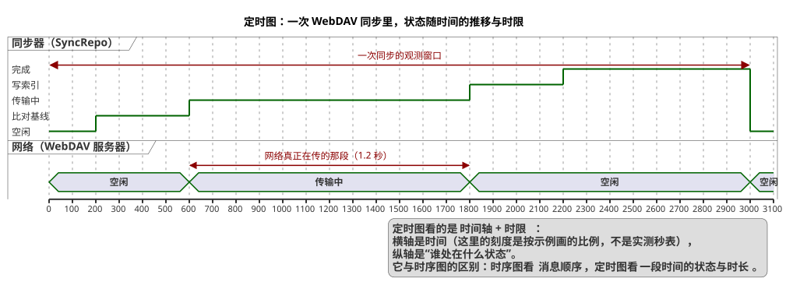

# 15 · 定时图（Timing Diagram）

## ① 一句话

**定时图讲"一段时间里谁处在什么状态、各段多长"**——横轴是时间，纵轴是几个对象的状态。
要说明"一次同步里，网络真正在传的只有 1 秒多，其余时间在比对和写索引"，用它最直观。

## ② 关键元素（方框和箭头各代表什么）

| 元素 | 长什么样 | 意思 |
|---|---|---|
| 生命线（Lifeline） | 一条横向的**状态带**（左边竖直写名字） | 每个被观察的对象/角色一行 |
| 状态（State） | 状态带上的**分段**（每段写状态名） | 这段时间它处在什么状态（空闲 / 比对基线 / 传输中 / 写索引 / 完成） |
| 时间轴（Time Axis） | 底部刻度（`@0`、`@200`…） | 时间刻度；`scale` 控制它画多宽 |
| 状态变化点（Event） | 分段的边界（时间点） | 该时刻发生状态切换 |
| 时间约束（Duration Constraint） | 带箭头的区间（`@0 <-> @3000`） | 某段状态的**时长/观测窗口**（本图：一次同步的窗口、网络真正在传的那段） |
| 消息（Message，本图未用） | 两条生命线之间的箭头 | 一个对象在这段时间里给另一个发了消息 |
| 图例（`legend`） | 方框 | 补充说明 |

**和时序图的区别**：时序图看**消息顺序**，定时图看**持续状态与时长**（"这 1.2 秒里网络是忙的"）。

## ③ 用共用小例子画的最小示例

**讲的是**：共用小例子（**随笔 App / mark-readnotes**，名词表见 `01-选哪种图.md` §2）里**一次 WebDAV 同步**的时间线——
两条生命线（**同步器** SyncRepo、**网络** WebDAV 服务器），从"空闲 → 比对基线 → 传输中 → 写索引 → 完成 → 空闲"。

看图要点：

- 上面那条＝**同步器**的状态：空闲 → 比对基线（跟本地基线上的一版比）→ 传输中 → 写索引 → 完成 → 空闲；
- 下面那条＝**网络**：只有在"传输中"那段才是忙的（图中给了 `网络真正在传的那段（1.2 秒）` 的区间约束）；
- 横轴刻度代表"一次同步的观测窗口"（**这是示例比例，不是实测秒表**——诚实标注：我们没有对同步做过秒级埋点）；
- 定时图的实用场景：以后要定**超时策略**（比如"网络 30 秒没动静就报错"）时，就画在这张图上。

## ④ 源与校验

- 源：`src/timing-diagram.puml`（`!pragma layout smetana`；`scale 100 as 30 pixels` 控制宽度，避免图过宽）
- 图：`figures/timing-diagram.svg`
- 校验读数：`evidence/校验-轮4.txt`（`-checkonly` **rc=0、无 error**；`-tsvg` rc=0；**错误占位检查=0**）

> 本轮踩到的第三个坑（已修）：定时图里**不接受"游离 note"**（`note right of SYNC` 直接 `Error line 39`）⇒ 整体说明改用 `legend right`。
> 另外第一版 `scale 1 as 40 pixels` 让 svg 变成 **562KB**（时间跨度 3000 单位 × 40px）；改成 `scale 100 as 30 pixels` 后 **20.9KB**。
> 待确认：**同步的秒级耗时没有实测**（本图的时长是示例值），要精确数字得先在同步流程里加埋点。
